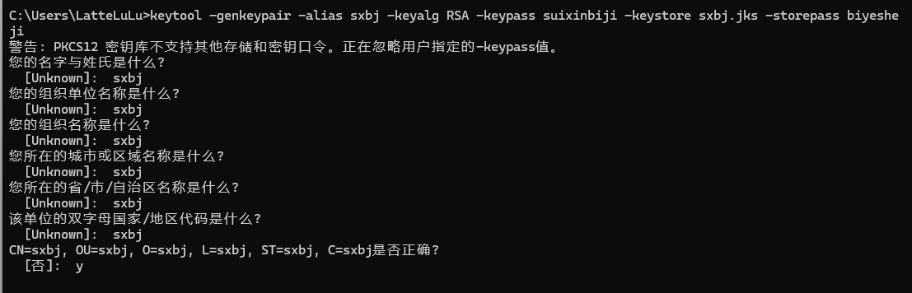

# 记录

## 1

企业项目也是这样吗
-企业项目用SpringSecurity呗
-我们使用shiro，会自动生成cookie并自动带入到请求头返回给前端	

## 2

重点看hmall-service中CartServiceImpl-handleCartItems()的实现过程
中间使用了数据流

## 3

maven聚合 

## 4

@Api(tags="xxxxxxxxxx")
@ApiOperation("xxxxxxxxxxx")
@AllArgsConstructor				作用

## 5

DTO，PO，VO
DTO是接收前端发送数据的实体类，服务器内部不同层之间传递数据
PO是跟数据库映射的实体类
VO是返回给页面的实体类

## 6

SpringCloud中的依赖注入：
不推荐使用
@Autowired
privite UserService userService;
推荐使用：
@Service
@RequiredArgsConstructor		//必备参数的构造函数，不用再手动编写有参构造方法
public class CartServiceImpl extends ServiceImpl<CartMapper, Cart> implements ICartService {
    private final RestTemplate restTemplate;

## 7

Springboot通过创建WebMvcConfig类 并继承接口WebMvcConfigurer来添加springmvc配置（拦截器、视图跳转控制器、静态资源处理器等等）

## 8

Springboot启动默认是扫描启动类所在目录下的包，并将这些包注册成@Bean

如果就是要扫描到启动类所在包目录之外的类，使其生成bean对象，可以在启动类上加@[ComponentScan注解](https://so.csdn.net/so/search?q=ComponentScan注解&spm=1001.2101.3001.7020)：

## 9

@ConditionalOnClass（某个class位于类路径上，才会实例化一个Bean）

```shell
# ObjectMapper.class是序列化和反序列化的工具类。
# 该代码意思是在创建序列化工具是引入JsonCOnfig.class类
@ConditionalOnClass(ObjectMapper.class)
public class JsonCOnfig{}

# 
@ConditionalOnClass(DispatcherServlet.class)

@ConditionalOnClass({MybatisPlusInterceptor.class, BaseMapper.class})
```

## 10

springboot2.7.13版本与jackson2.9.0版本冲突，可用springboot内置jackson版本2.13.5

## 11

用户登录加密

1. 引入两个依赖
2. 生成ras密钥


## 12

>  ras密钥生成——公钥+私钥
>
>  [SpringBoot SpringSecurity JWT+Redis+RSA授权登录登出 验证码 前后端分离 分布式_spring-security-rsa-CSDN博客](https://blog.csdn.net/qq_50909707/article/details/127186268?ops_request_misc=&request_id=&biz_id=102&utm_term=spring-security-rsa&utm_medium=distribute.pc_search_result.none-task-blog-2~all~sobaiduweb~default-4-127186268.142^v100^pc_search_result_base3&spm=1018.2226.3001.4187)
>
>   
>
>  按照T13下载openssl后，公钥获取成功

```shell
# 生成私钥
// 以下指令为一行，设置多行是方便阅读
keytool -genkeypair 
-alias 密钥别名 
-keyalg 使用的算法 
-keypass 密钥的访问密码 
-keystore 生成的密钥库文件名，扩展名是jks
-storepass 密钥库的访问密码，用来打开jks文件

// 以下指令为一行，设置多行是方便阅读
keytool -genkeypair -alias sxbj -keyalg RSA -keypass suixinbiji -keystore sxbj.jks -storepass biyesheji
```



```shell
# 生成公钥
keytool -list -rfc --keystore jks文件(包含扩展名.jks) | openssl x509 -inform pem -pubkey

keytool -list -rfc --keystore sxbj.jks | openssl x509 -inform pem -pubkey


D:\bbb\SXBJ_bishe01\sxbj_bishe_01\src\main\resources>keytool -list -rfc --keystore sxbj.jks | openssl x509 -inform pem -pubkey
输入密钥库口令:  biyesheji
-----BEGIN PUBLIC KEY-----
MIIBIjANBgkqhkiG9w0BAQEFAAOCAQ8AMIIBCgKCAQEAvmk6fhGtlLGFfrxA/k4O
1kWolin6QTka7ATJ7ZcFSCid2VohR1br6WtPpbB11k/S72WGqBSk6Y2nJ3ZSkfQs
YTrzqjL2za2CeC0G9+yf1lbtB+lQDXSFgtNESwAPzuUjg/VyB0C1ln+Bb0uPCmHf
AY9SnKJNfycSnmSsonjIK1otyeqqkItmR+5e7SbyhYZNMarZ2ujn7qBDabaK0WvL
FPucraZq5ZeU214QQqEkeDue8nHFSlBr6kmvPZzBAnDXwu+5EoPXiMnbFxcu0GNm
Z+j3eWB5GIvg8Clou9CTfveHJo2w5aJlsb1v4GkeUCt8aZ0yjshDj/wmvkXf1PXZ
7wIDAQAB
-----END PUBLIC KEY-----
-----BEGIN CERTIFICATE-----
MIIDUzCCAjugAwIBAgIEYgUQVDANBgkqhkiG9w0BAQsFADBaMQ0wCwYDVQQGEwRz
eGJqMQ0wCwYDVQQIEwRzeGJqMQ0wCwYDVQQHEwRzeGJqMQ0wCwYDVQQKEwRzeGJq
MQ0wCwYDVQQLEwRzeGJqMQ0wCwYDVQQDEwRzeGJqMB4XDTI0MDQwNTA3MTIxM1oX
DTI0MDcwNDA3MTIxM1owWjENMAsGA1UEBhMEc3hiajENMAsGA1UECBMEc3hiajEN
MAsGA1UEBxMEc3hiajENMAsGA1UEChMEc3hiajENMAsGA1UECxMEc3hiajENMAsG
A1UEAxMEc3hiajCCASIwDQYJKoZIhvcNAQEBBQADggEPADCCAQoCggEBAL5pOn4R
rZSxhX68QP5ODtZFqJYp+kE5GuwEye2XBUgondlaIUdW6+lrT6WwddZP0u9lhqgU
pOmNpyd2UpH0LGE686oy9s2tgngtBvfsn9ZW7QfpUA10hYLTREsAD87lI4P1cgdA
tZZ/gW9Ljwph3wGPUpyiTX8nEp5krKJ4yCtaLcnqqpCLZkfuXu0m8oWGTTGq2dro
5+6gQ2m2itFryxT7nK2mauWXlNteEEKhJHg7nvJxxUpQa+pJrz2cwQJw18LvuRKD
14jJ2xcXLtBjZmfo93lgeRiL4PApaLvQk373hyaNsOWiZbG9b+BpHlArfGmdMo7I
Q4/8Jr5F39T12e8CAwEAAaMhMB8wHQYDVR0OBBYEFA/b8vnvgHmZe44P7AGMCbKV
75O+MA0GCSqGSIb3DQEBCwUAA4IBAQBGmuNGn/gVg6GySEtvv4d+i5/Kx4QFwGII
D/tR6idk56s+giJ+jCTR2TCNiebpjAz4Z5wmYiABToCIIDzJv12GKaS+Qm7LBb3P
gE5f6b3yEOAl/tAk+f+4HU/dz/APDpkGxJRhADSUjcD/gwFSV0VJvOV0INY3OAGA
7JXn7rSMkbwspSHJTHwtMGE4Zvo+nwCM3FBc/E+Pe+fJpdtxsuKQmxVK0hpOoviP
c4xGG0WZWoIPU0AP/0GFlIyzcGBCGa8Sz6OWUtPQhjXKkwj4n3myaibWHuyHTVLE
n8JYRJJcdiZIkXDrnwEgEe+lZJ4F3Q8mt1xppwR8Azu974CttWQw
-----END CERTIFICATE-----
```


## 13

> openssl下载过程
>
> [02-开始编译OpenSSL_哔哩哔哩_bilibili](https://www.bilibili.com/video/BV1Fv411J7ME?p=2&vd_source=6e6c8cfa1a564255ef474e2ff5bae766)


## 14

把mvn仓库中以下依赖下载的包删除后，pom文件中以下依赖竟然不报错，不知道为啥

可能是因为其他的依赖导入出错，致使还没有走到导入以下依赖的地方就报错——spring-boot-starter-test重复导入，logging父工程大导入子模块未导入

```xml
        <dependency>
            <groupId>org.springframework.security</groupId>
            <artifactId>spring-security-crypto</artifactId>
        </dependency>
        <dependency>
            <groupId>org.springframework.security</groupId>
            <artifactId>spring-security-rsa</artifactId>
            <version>1.0.9.RELEASE</version>
        </dependency>
```


## 15

Service层使用MybatisPlus提供的方法，需进行以下配置

```shell
# 1 service接口继承Iservice<T>
public interface UserService extends IService<User> {}

# 2 ServiceImpl接口继承ServiceImpl<TMapper,T>
public class UserServiceImpl extends ServiceImpl<UserDao, User> implements UserService {}

# 3 mapper层继承BaseMapper<T>
public interface UserDao extends BaseMapper<User> {}
```


## 16

mybatis改为mybatisplus后，parameterType是String爆红

```xml
<!--    可以把parameterType删除试试看，-->
<!--    以前parameterType是String爆红，修改为string之后不暴红了，下方的string都是从哪个String改过来的-->
    <select id="findUserByUserName" parameterType="string" resultType="User">
```


## 17

不用编写代码校验token是否被修改，因为JwtTool中parseToken()方法已经校验过了

可以保证token不被修改，但是单点登录不知道能否保证

```text
上述Java函数通过以下几个步骤来检测token是否被修改：
JWT解析：
使用JWT.of(token)方法尝试解析传入的token字符串。如果token的格式不正确或签名部分（通常包含在token的最后部分）与payload（载荷）和header（头部）使用指定的signer（签名器）计算得出的签名不符，此时会抛出异常。这意味着任何对token内容的非授权修改，包括更改其中的任何字符，都将导致签名验证失败，从而在解析阶段即被检测出来。
JWT有效性验证：
在成功解析出JWT对象后，调用jwt.verify()方法进一步验证其有效性。此步骤通常包括确认签名正确性之外的其他条件，如检查是否由可信的issuer（签发者）发出、是否在指定的有效期内等。如果token被修改，这些条件很可能不再满足，导致verify()方法返回false，进而抛出“无效的token”异常。
过期时间验证：
使用JWTValidator.of(jwt).validateDate()来专门检查token的过期时间（exp claim）。如果token被修改以延长其有效期，或者调整为已过期的状态，这个步骤会检测到这种非法变动，并抛出“token已经过期”异常。
用户信息数据格式校验：
从解析后的JWT中提取名为“user”的payload数据，检查其是否为null。若被修改导致该数据丢失或被移除，此处会识别出问题并抛出“无效的token”异常。
尝试将提取的“user”数据转换为Long类型。如果token被篡改导致“user”数据的内容不再是合法的数字格式，这里的转换操作会引发RuntimeException，函数捕获后抛出“无效的token”异常。
综上所述，只要token的任何部分（包括头部、载荷或签名）遭到改动，或者其内部数据（如用户信息）被非法修改，上述代码在解析、验证、过期检查和数据格式转换过程中都可能触发异常，从而检测到token已被修改。
```


## 18

Apifox软件如何添加Auth

在根目录中设置Auth为 **Bearer Token** ，把生成的token直接填入即可

在使用子请求访问时，会自动添加Auth到Header中


## 19

对于URI格式的参数，用@PathVariable("xxxxx")注解接收

```java
 @GetMapping("/addFavorite/{lcid}")
    public ResultInfo addFavorite(@PathVariable("lcid") int lcid){}
```


## 20

java中list转数组

参考：[java List和数组相互转换方法_javalist转为数组-CSDN博客](https://blog.csdn.net/zjx2016/article/details/78273192)

```java
//要转换的list集合
 List<String> testList = new ArrayList<String>(){{add("aa");add("bb");add("cc");}};

 //使用toArray(T[] a)方法
 String[] array2 = testList.toArray(new String[testList.size()]);

//打印该数组
  for(int i = 0; i < array2.length; i++){
      System.out.println(array2[i]);
  }
```


## 21

form表单提交checkbox的json格式为

```json
{
    "ball":["basketball","pingpang","football"]
}
```


## 22

> springboot中redis
>
> 参考：[RedisTemplate的基本使用方法_redistemplate.expire-CSDN博客](https://blog.csdn.net/a1120467800/article/details/109907393)
>
> 

```java
BoundHashOperations<String, String, LabelContent> lcMap1 = redisTemplate.boundHashOps("lcMap");

// List<LabelContent> values = lcMap1.values();  正常获取是list集合，要用map集合lcMap1.entries();
Map<String, LabelContent> entries = lcMap1.entries();
```


## 23

mybatis-plus根据不同id，修改每个id对应的属性值

```
List<User> userList = new ArrayList<>();
User user1 = new User();
user1.setId(1L);
user1.setName("Tom");
userList.add(user1);

User user2 = new User();
user2.setId(2L);
user2.setName("Jerry");
userList.add(user2);

// 调用 updateBatchById 方法批量修改记录
boolean success = userService.updateBatchById(userList);

if (success) {
  System.out.println("批量修改成功！");
} else {
  System.out.println("批量修改失败！");
}
```


## 24

把integer改为string试试吧，真的很无语

> 纠正：redis是不支持直接保存对象的，需要先把对象序列化为二进制才能保存到redis中
>
> 序列化存入redis和mysql取数据：
>
> ​	当对象很小时，二者性能相似，当对象很大时，redis更快，mysql必须要有磁盘操作，当大量操作mysql，速度会比redis慢很多
>
> hutool中提供了将对象序列化的方法：
>
> ​	SerializeUtil.serialize(  java对象  )
>
> ​	SerializeUtil.deserialize(  java对象  )
>
> 直接给po类继承Serialize接口不能用
>
>  
>
> 先将对象转化为byte[] 再转为string，再存入redis中，该方法是不可以的，存储的最终结果为
>
> ```shell
> 40 -> [B@988de38
> ```
>
>  
>
> redisTemplate.opsForHash().putAll(key,HashMap<String,LabelContent>)	也不可以


## 25

> vue 后台管理系统模板
>
>  [能不能推荐个 vue 后台管理系统模板？ - 知乎 (zhihu.com)](https://www.zhihu.com/question/317831989)


# 待改进

## 1-yes

目前springboot引入redis是引入redis的具体版本号，

并没用spring-boot-starter-data-redis代替，以后需改进


## 2

token修改校验可以检测出，单点登录未知

logout登出操作未实现


## 3

密码加密没有使用


## 4

LFM实现过程-1：

数据库存储

```shell
# 前端
userid		用户id
pageUrl		浏览的路径，页面
behavior	用户行为类型
timestamp	行为发生时间
			历史搜索记录
			浏览时长
			用户点赞
			
			关注列表
```

> 数据库表

```shell
# 用户行为信息表		browsingHistory
uid			用户id
lcid		标签id
createtime	浏览时间
page		浏览页面
duration	浏览时长
num			浏览次数

# 用户相似度匹配结果		userSimilarity
uid 		用户id
userlist	相似用户列表


# 用户推荐列表	recommend
uid				用户id
recommendlist	推荐列表

# 用户历史搜索记录		searchHistory
uid				用户id
searchcontent	搜索内容
createtime		搜索时间

# 用户喜爱标签	perfer		future
uid			用户id
perference	用户偏好标签

# 用户好友列表	xxxxxxx		futrue	
uid1		用户1的id
uid2		用户2的id
```

> 页面

```shell
# 页面添加	
聊天框		future


```

> 功能添加


## 5

可在用户搜索时，在搜索框下展示相关的搜索内容，提高用户体验
